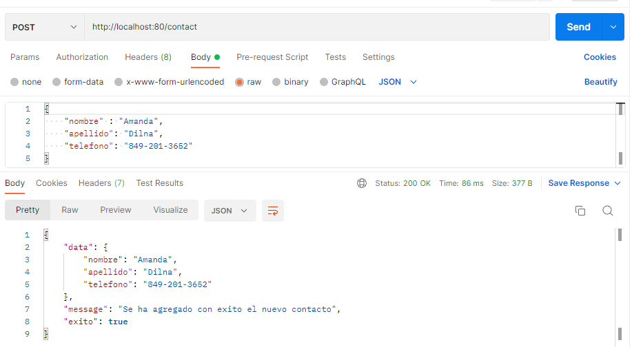
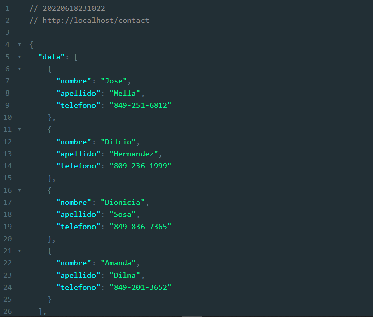
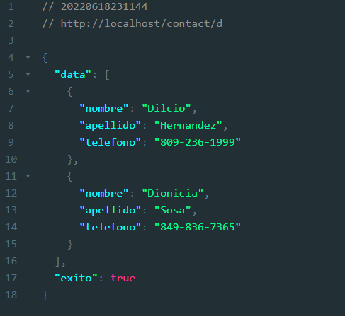

# Tarea 5 - Programación Web

- Nombre: Bryan Xavier Florentino Montero
- Matrícula: 2020-10674

## Servicio web con NodeJs y Express

Haga un servicio Web utilizando la librería express de nodeJS que haga las dos
operaciones básicas de listar y almacenar contactos realizados por el servicio
http://www.raydelto.org/agenda.php el cual usted ha utilizado en las dos tarea
anteriores.

## Capturas de pantalla

### Peticion post al servidor con Postman. Almacenar un nuevo contacto

### Peticion Get al servidor (desde un navegador). Obtiene todos los contactos 

### Peticion Get al servidor (desde un navegador). Obtiene todos los contactos que coincidan con un patrón. En este caso la letra d

